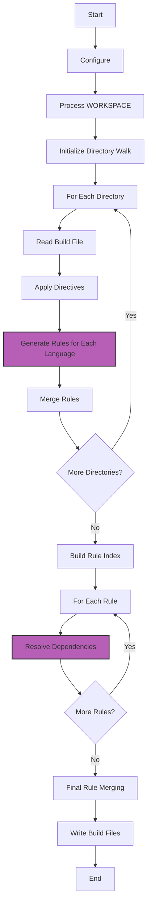

# New language plugin guide
> Or how I learned to stop complaining and contribute to open source
>
> Written while building a plugin against gazelle v0.33.0

So you aren't lucky enough to work in a fancy enough language to have a lovely
gazelle plugin already written for you.

Well buckle up, this is my rough notes as I dig in and try to understand and document
this system so we can all benefit.

To kick things off here's a short diagram of the general flow of gazelle

At a high level the pink boxes represent nodes where language plugins are directly involved,
though as you'll see there are lots of lifecycle hooks where the language plugin code will be
called.

## The `Language` interface

If you've read the [extend docs](./extend.md), you already know the first step to creating a
new language plugin is implementing the [`language.Language` interface](https://godoc.org/github.com/bazelbuild/bazel-gazelle/language#Language)

But what's not really covered in this is how the methods on this interface are called.

Below is a list of how the methods of the `language.Language` interface are typically
called during Gazelle's execution:

1. `RegisterFlags(fs *flag.FlagSet, cmd string, c *config.Config)`
    - Called early in the process to register language-specific command-line flags.

2. `CheckFlags(fs *flag.FlagSet, c *config.Config) error`
    - Called after flag parsing to validate and process the flags.

3. `KnownDirectives() []string`
    - Called to get a list of directives the language understands.

4. `Configure(c *config.Config, rel string, f *rule.File)`
    - Called for each directory to set up language-specific configuration.

5. `Name() string`
    - May be called at various points to identify the language.

6. `Kinds() map[string]rule.KindInfo`
    - Called to get information about the kinds of rules the language generates.

7. `Loads() []rule.LoadInfo`
    - Called to get information about the load statements needed for the language.
    - Deprecated: Instead implement `ModuleAwareLanguage`'s `ApparentLoads`.

8. `GenerateRules(args language.GenerateArgs) language.GenerateResult`
    - Called for each directory to generate rules based on the files in that directory.

9. `Imports(c *config.Config, r *rule.Rule, f *rule.File) []resolve.ImportSpec`
    - Called for each rule to determine its imports.

10. `Embeds(r *rule.Rule, from label.Label) []label.Label`
    - Called to determine what other rules a given rule embeds.

11. `Resolve(c *config.Config, ix *resolve.RuleIndex, rc *repo.RemoteCache, r *rule.Rule, imports interface{}, from label.Label)`
    - Called for each rule to resolve its dependencies.

12. `Fix(c *config.Config, f *rule.File)`
    - Called to fix any issues in the build file before processing.

Note that some methods like `Name()`, `Kinds()`, and `Loads()` might be called multiple times throughout the process. The core of your plugin's work will likely be in `GenerateRules()` and `Resolve()`.

If your language implements additional interfaces like `language.RepoImporter` or `language.ModuleAwareLanguage`, those methods would be called at appropriate times as well.
